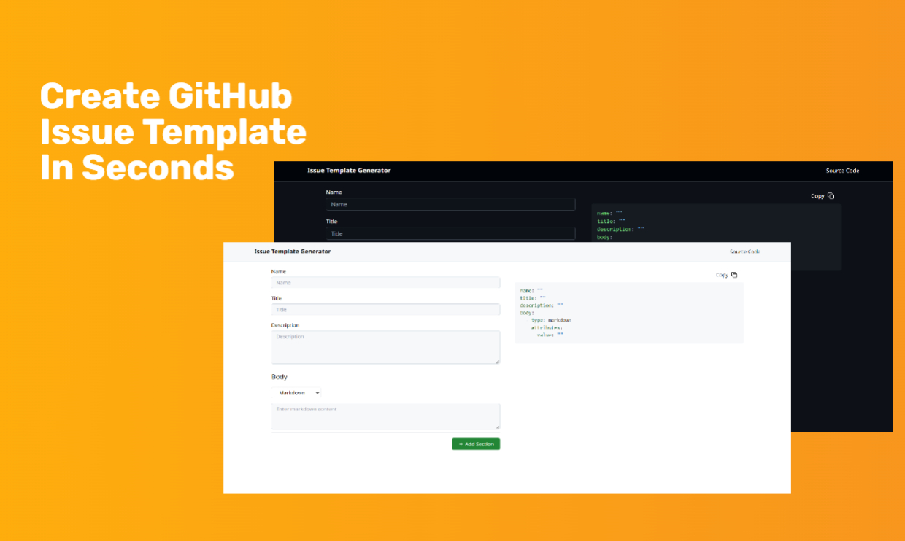

# GitHub Issue Template Generator

A tool to generate custom GitHub issue templates. This project helps you create issue templates with sections like Markdown, Input, Textarea, Dropdown, and Checkboxes, allowing for easy configuration of your project's issue management.

Made Proudly In Myanmar 🇲🇲 With ❤️